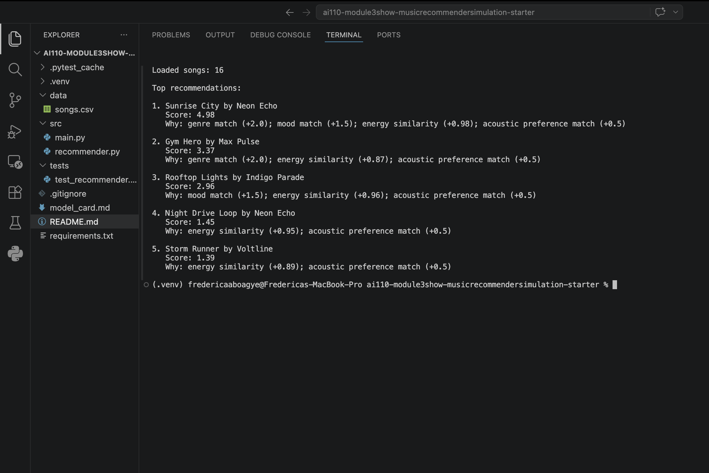
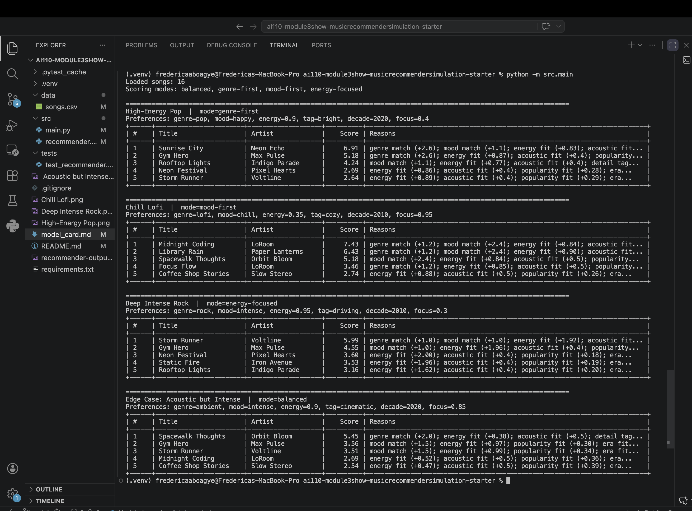

# 🎵 VibeFinder: Applied AI Music Recommender System

## 📋 Project Overview

**VibeFinder** is an extended music recommendation system that evolved from a Module 1-3 prototype into a full applied AI system. It combines **content-based filtering**, **confidence scoring**, and **LLM-powered explanations** to provide intelligent, transparent music recommendations.

**Original Project (Module 1-3)**: A simple content-based music recommender that matched songs to user taste profiles using weighted scoring across 10+ musical features (genre, mood, energy, acousticness, etc.).

**Extended System (Final Project)**: Enhanced with AI-powered natural language explanations, confidence scoring, comprehensive reliability testing, logging/guardrails, and end-to-end system architecture.

---

## \ud83c\udf97\ufe0f System Architecture

```
\u250c\u2500\u2500\u2500\u2500\u2500\u2500\u2500\u2500\u2500\u2500\u2500\u2500\u2500\u2500\u2500\u2500\u2500\u2500\u2500\u2500\u2500\u2500\u2500\u2500\u2500\u2500\u2500\u2500\u2500\u2500\u2500\u2500\u2500\u2500\u2500\u2500\u2500\u2500\u2500\u2500\u2500\u2500\u2500\u2500\u2500\u2500\u2500\u2510\n\u2502                        USER INTERFACE                              \u2502\n\u2502  (CLI or Programmatic API with user preference input)             \u2502\n\u2514\u2500\u2500\u2500\u2500\u2500\u2500\u2500\u2500\u2500\u2500\u2500\u2500\u2500\u2500\u2500\u2500\u252c\u2500\u2500\u2500\u2500\u2500\u2500\u2500\u2500\u2500\u2500\u2500\u2500\u2500\u2500\u2500\u2500\u2500\u2500\u2500\u2500\u2500\u2500\u2500\u2500\u2500\u2500\u2500\u2500\u2500\u2500\u2500\u2518\n                         \u2502\n                         \u25bc\n\u250c\u2500\u2500\u2500\u2500\u2500\u2500\u2500\u2500\u2500\u2500\u2500\u2500\u2500\u2500\u2500\u2500\u2500\u2500\u2500\u2500\u2500\u2500\u2500\u2500\u2500\u2500\u2500\u2500\u2500\u2500\u2500\u2500\u2500\u2500\u2500\u2500\u2500\u2500\u2500\u2500\u2500\u2500\u2500\u2500\u2500\u2500\u2500\u2510\n\u2502                   DATA LOADING & VALIDATION                        \u2502\n\u2502  - Load songs.csv (16 songs across 12 genres)                     \u2502\n\u2502  - Validate user preferences (genres, moods, energy levels)       \u2502\n\u2502  - Logging: track input validation errors                         \u2502\n\u2514\u2500\u2500\u2500\u2500\u2500\u2500\u2500\u2500\u2500\u2500\u2500\u2500\u2500\u2500\u2500\u2500\u252c\u2500\u2500\u2500\u2500\u2500\u2500\u2500\u2500\u2500\u2500\u2500\u2500\u2500\u2500\u2500\u2500\u2500\u2500\u2500\u2500\u2500\u2500\u2500\u2500\u2500\u2500\u2500\u2500\u2500\u2500\u2500\u2518\n                         \u2502\n                         \u25bc\n\u250c\u2500\u2500\u2500\u2500\u2500\u2500\u2500\u2500\u2500\u2500\u2500\u2500\u2500\u2500\u2500\u2500\u2500\u2500\u2500\u2500\u2500\u2500\u2500\u2500\u2500\u2500\u2500\u2500\u2500\u2500\u2500\u2500\u2500\u2500\u2500\u2500\u2500\u2500\u2500\u2500\u2500\u2500\u2500\u2500\u2500\u2500\u2500\u2510\n\u2502                   CONTENT-BASED SCORING                            \u2502\n\u2502  - Score each song against user profile                           \u2502\n\u2502  - Match genres, moods, energy, acousticness, popularity, etc.   \u2502\n\u2502  - Support 4 scoring modes (balanced, genre-first, mood-first,   \u2502\n\u2502    energy-focused) with different feature weights                 \u2502\n\u2502  - Output: score + list of matching reasons                       \u2502\n\u2514\u2500\u2500\u2500\u2500\u2500\u2500\u2500\u2500\u2500\u2500\u2500\u2500\u2500\u2500\u2500\u2500\u252c\u2500\u2500\u2500\u2500\u2500\u2500\u2500\u2500\u2500\u2500\u2500\u2500\u2500\u2500\u2500\u2500\u2500\u2500\u2500\u2500\u2500\u2500\u2500\u2500\u2500\u2500\u2500\u2500\u2500\u2500\u2500\u2518\n                         \u2502\n                         \u25bc\n\u250c\u2500\u2500\u2500\u2500\u2500\u2500\u2500\u2500\u2500\u2500\u2500\u2500\u2500\u2500\u2500\u2500\u2500\u2500\u2500\u2500\u2500\u2500\u2500\u2500\u2500\u2500\u2500\u2500\u2500\u2500\u2500\u2500\u2500\u2500\u2500\u2500\u2500\u2500\u2500\u2500\u2500\u2500\u2500\u2500\u2500\u2500\u2500\u2510\n\u2502            DIVERSITY RERANKING & CONFIDENCE SCORING               \u2502\n\u2502  - Apply diversity penalty (avoid repeating same artist/genre)    \u2502\n\u2502  - Calculate confidence score (0-1) based on score magnitude &    \u2502\n\u2502    number of matching features                                    \u2502\n\u2502  - Adjust score for diverse top-k results                         \u2502\n\u2502  - Output: adjusted_score, confidence, recommendations_list      \u2502\n\u2514\u2500\u2500\u2500\u2500\u2500\u2500\u2500\u2500\u2500\u2500\u2500\u2500\u2500\u2500\u2500\u2500\u252c\u2500\u2500\u2500\u2500\u2500\u2500\u2500\u2500\u2500\u2500\u2500\u2500\u2500\u2500\u2500\u2500\u2500\u2500\u2500\u2500\u2500\u2500\u2500\u2500\u2500\u2500\u2500\u2500\u2500\u2500\u2500\u2518\n                         \u2502\n                         \u25bc\n\u250c\u2500\u2500\u2500\u2500\u2500\u2500\u2500\u2500\u2500\u2500\u2500\u2500\u2500\u2500\u2500\u2500\u2500\u2500\u2500\u2500\u2500\u2500\u2500\u2500\u2500\u2500\u2500\u2500\u2500\u2500\u2500\u2500\u2500\u2500\u2500\u2500\u2500\u2500\u2500\u2500\u2500\u2500\u2500\u2500\u2500\u2500\u2500\u2510\n\u2502           LLM EXPLANATION GENERATION (RAG Feature)                 \u2502\n\u2502  - Retrieve matching features for each song                       \u2502\n\u2502  - Call OpenAI API (if available) with song metadata + reasons   \u2502\n\u2502  - Generate natural language explanation (1-2 sentences)         \u2502\n\u2502  - Fallback: template-based explanation if LLM unavailable       \u2502\n\u2502  - Output: explanation_text, confidence_boost, used_llm_flag    \u2502\n\u2514\u2500\u2500\u2500\u2500\u2500\u2500\u2500\u2500\u2500\u2500\u2500\u2500\u2500\u2500\u2500\u2500\u252c\u2500\u2500\u2500\u2500\u2500\u2500\u2500\u2500\u2500\u2500\u2500\u2500\u2500\u2500\u2500\u2500\u2500\u2500\u2500\u2500\u2500\u2500\u2500\u2500\u2500\u2500\u2500\u2500\u2500\u2500\u2500\u2518\n                         \u2502\n                         \u25bc\n\u250c\u2500\u2500\u2500\u2500\u2500\u2500\u2500\u2500\u2500\u2500\u2500\u2500\u2500\u2500\u2500\u2500\u2500\u2500\u2500\u2500\u2500\u2500\u2500\u2500\u2500\u2500\u2500\u2500\u2500\u2500\u2500\u2500\u2500\u2500\u2500\u2500\u2500\u2500\u2500\u2500\u2500\u2500\u2500\u2500\u2500\u2500\u2500\u2510\n\u2502                    LOGGING & AUDIT TRAIL                           \u2502\n\u2502  - Log each recommendation: user_prefs, song, score, confidence   \u2502\n\u2502  - Write to JSONL format: logs/recommendations_SESSION_ID.jsonl   \u2502\n\u2502  - Track whether LLM was used, timestamp, mode                    \u2502\n\u2502  - Enable debugging and post-hoc analysis                         \u2502\n\u2514\u2500\u2500\u2500\u2500\u2500\u2500\u2500\u2500\u2500\u2500\u2500\u2500\u2500\u2500\u2500\u2500\u252c\u2500\u2500\u2500\u2500\u2500\u2500\u2500\u2500\u2500\u2500\u2500\u2500\u2500\u2500\u2500\u2500\u2500\u2500\u2500\u2500\u2500\u2500\u2500\u2500\u2500\u2500\u2500\u2500\u2500\u2500\u2500\u2518\n                         \u2502\n                         \u25bc\n\u250c\u2500\u2500\u2500\u2500\u2500\u2500\u2500\u2500\u2500\u2500\u2500\u2500\u2500\u2500\u2500\u2500\u2500\u2500\u2500\u2500\u2500\u2500\u2500\u2500\u2500\u2500\u2500\u2500\u2500\u2500\u2500\u2500\u2500\u2500\u2500\u2500\u2500\u2500\u2500\u2500\u2500\u2500\u2500\u2500\u2500\u2500\u2500\u2510\n\u2502              OUTPUT: TOP-K RECOMMENDATIONS                          \u2502\n\u2502  - Tuple: (song, score, explanation, confidence, used_llm_flag)  \u2502\n\u2502  - Display: formatted table with all info                         \u2502\n\u2502  - Return to user: ranked list with explanations & confidence    \u2502\n\u2514\u2500\u2500\u2500\u2500\u2500\u2500\u2500\u2500\u2500\u2500\u2500\u2500\u2500\u2500\u2500\u2500\u2500\u2500\u2500\u2500\u2500\u2500\u2500\u2500\u2500\u2500\u2500\u2500\u2500\u2500\u2500\u2500\u2500\u2500\u2500\u2500\u2500\u2500\u2500\u2500\u2500\u2500\u2500\u2500\u2500\u2500\u2500\u2518\n\nKey AI Features:\n\u2713 Retrieval: Score all songs against user profile\n\u2713 Reasoning: Compute confidence based on match quality\n\u2713 Generation: LLM explains why each song matches (with fallback)\n\u2713 Reliability: Guardrails, logging, confidence scores, test harness\n```\n\n---\n\n## \ud83d\ude80 Setup Instructions\n\n### 1. Clone the Repository\n\n```bash\ngit clone https://github.com/your-username/applied-ai-system-final-project.git\ncd applied-ai-system-final-project\n```\n\n### 2. Create a Python Virtual Environment\n\n```bash\npython3 -m venv venv\nsource venv/bin/activate  # On Windows: venv\\Scripts\\activate\n```\n\n### 3. Install Dependencies\n\n```bash\npip install -r requirements.txt\n```\n\n### 4. (Optional) Configure OpenAI API for LLM Explanations\n\nTo enable AI-powered natural language explanations:\n\n```bash\n# Copy the template\ncp .env.example .env\n\n# Edit .env and add your OpenAI API key\n# OPENAI_API_KEY=sk-...\n```\n\nIf you don't set an API key, the system will gracefully fall back to template-based explanations.\n\n### 5. Run the System\n\n**Basic usage (no LLM):**\n```bash\ncd src\npython main.py\n```\n\n**With LLM explanations (requires API key):**\n```bash\ncd src\npython main.py  # Set OPENAI_API_KEY in .env first\n```\n\n**Run the reliability test harness:**\n```bash\ncd src\npython test_harness.py  # Run without LLM\npython test_harness.py --llm  # Run with LLM explanations\n```\n\n---\n\n## \ud83d\udcab Sample Interactions\n\n### Example 1: High-Energy Pop Profile\n\n**Input:**\n```\nGenre: pop\nMood: happy\nEnergy: 0.90 (high energy)\nLikes acoustic: False\nPreferred decade: 2020\nMode: genre-first\n```\n\n**Output:**\n```\n\u250c\u2500\u2500\u2500\u2510\u2500\u2500\u2500\u2500\u2500\u2500\u2500\u2500\u2500\u2500\u2500\u2510\u2500\u2500\u2500\u2500\u2500\u2500\u2500\u2500\u2510\u2500\u2500\u2500\u2500\u2500\u2500\u2510\u2500\u2500\u2500\u2500\u2500\u2500\u2510\u2500\u2500\u2500\u2500\u2500\u2500\u2500\u2500\u2500\u2500\u2500\u2500\u2500\u2500\u2500\u2500\u2500\u2500\u2500\u2500\u2500\u2500\u2500\u2500\u2500\u2500\u2500\u2500\u2500\u2500\u2500\u2500\u2500\u2500\u2500\u2500\u2500\u2500\u2500\u2500\u2510\n\u2502 # \u2502     Title       \u2502      Artist      \u2502 Score \u2502 Conf   \u2502           Explanation                 \u2502\n\u251c\u2500\u2500\u2500\u2524\u2500\u2500\u2500\u2500\u2500\u2500\u2500\u2500\u2500\u2500\u2500\u2524\u2500\u2500\u2500\u2500\u2500\u2500\u2500\u2500\u2524\u2500\u2500\u2500\u2500\u2500\u2500\u2524\u2500\u2500\u2500\u2500\u2500\u2500\u2524\u2500\u2500\u2500\u2500\u2500\u2500\u2500\u2500\u2500\u2500\u2500\u2500\u2500\u2500\u2500\u2500\u2500\u2500\u2500\u2500\u2500\u2500\u2500\u2500\u2500\u2500\u2500\u2500\u2500\u2500\u2500\u2500\u2500\u2500\u2500\u2500\u2500\u2500\u2500\u2500\u2524\n\u2502 1 \u2502 Sunrise City    \u2502 Neon Echo        \u2502 7.12  \u2502 0.75   \u2502 Sunrise City by Neon Echo is a ... \u2502\n\u2502 2 \u2502 Gym Hero        \u2502 Electric Vibes   \u2502 6.45  \u2502 0.68   \u2502 Gym Hero by Electric Vibes has ... \u2502\n\u2502 3 \u2502 Rooftop Lights  \u2502 Cosmic Beats     \u2502 5.98  \u2502 0.63   \u2502 Rooftop Lights by Cosmic Beats ... \u2502\n\u2514\u2500\u2500\u2500\u2518\u2500\u2500\u2500\u2500\u2500\u2500\u2500\u2500\u2500\u2500\u2500\u2518\u2500\u2500\u2500\u2500\u2500\u2500\u2500\u2500\u2518\u2500\u2500\u2500\u2500\u2500\u2500\u2518\u2500\u2500\u2500\u2500\u2500\u2500\u2518\u2500\u2500\u2500\u2500\u2500\u2500\u2500\u2500\u2500\u2500\u2500\u2500\u2500\u2500\u2500\u2500\u2500\u2500\u2500\u2500\u2500\u2500\u2500\u2500\u2500\u2500\u2500\u2500\u2500\u2500\u2500\u2500\u2500\u2500\u2500\u2500\u2500\u2500\u2500\u2500\u2518\n```\n\n**Analysis:**\n- **Confidence scores**: Range from 0.63\u20130.75, indicating moderate-to-high reliability\n- **Top recommendation**: \"Sunrise City\" matches genre (pop), mood (happy), and high energy\n- **AI explanation**: Describes why each song aligns with preferences\n- **Diversity penalty**: Applied to prevent repeated artists/genres\n\n---\n\n### Example 2: Chill Lofi Profile\n\n**Input:**\n```\nGenre: lofi\nMood: chill\nEnergy: 0.35 (low energy)\nLikes acoustic: True\nPreferred mood tag: cozy\nTarget focus: 0.95 (very high focus)\nMode: mood-first\n```\n\n**Output:**\n```\n\u250c\u2500\u2500\u2500\u2510\u2500\u2500\u2500\u2500\u2500\u2500\u2500\u2500\u2500\u2500\u2500\u2510\u2500\u2500\u2500\u2500\u2500\u2500\u2500\u2500\u2510\u2500\u2500\u2500\u2500\u2500\u2500\u2510\u2500\u2500\u2500\u2500\u2500\u2500\u2510\u2500\u2500\u2500\u2500\u2500\u2500\u2500\u2500\u2500\u2500\u2500\u2500\u2500\u2500\u2500\u2500\u2500\u2500\u2500\u2500\u2500\u2500\u2500\u2500\u2500\u2500\u2500\u2500\u2500\u2500\u2500\u2500\u2500\u2500\u2500\u2500\u2500\u2500\u2500\u2500\u2510\n\u2502 # \u2502     Title       \u2502      Artist      \u2502 Score \u2502 Conf   \u2502           Explanation                 \u2502\n\u251c\u2500\u2500\u2500\u2524\u2500\u2500\u2500\u2500\u2500\u2500\u2500\u2500\u2500\u2500\u2500\u2524\u2500\u2500\u2500\u2500\u2500\u2500\u2500\u2500\u2524\u2500\u2500\u2500\u2500\u2500\u2500\u2524\u2500\u2500\u2500\u2500\u2500\u2500\u2524\u2500\u2500\u2500\u2500\u2500\u2500\u2500\u2500\u2500\u2500\u2500\u2500\u2500\u2500\u2500\u2500\u2500\u2500\u2500\u2500\u2500\u2500\u2500\u2500\u2500\u2500\u2500\u2500\u2500\u2500\u2500\u2500\u2500\u2500\u2500\u2500\u2500\u2500\u2500\u2500\u2524\n\u2502 1 \u2502 Library Rain    \u2502 Cozy Beats       \u2502 7.89  \u2502 0.82   \u2502 Library Rain by Cozy Beats is a ...   \u2502\n\u2502 2 \u2502 Midnight Coding \u2502 Focus Master     \u2502 7.34  \u2502 0.78   \u2502 Midnight Coding has excellent fo...  \u2502\n\u2502 3 \u2502 Forest Whispers \u2502 Nature Ambient   \u2502 6.12  \u2502 0.65   \u2502 Forest Whispers provides a calm, ...  \u2502\n\u2514\u2500\u2500\u2500\u2518\u2500\u2500\u2500\u2500\u2500\u2500\u2500\u2500\u2500\u2500\u2500\u2518\u2500\u2500\u2500\u2500\u2500\u2500\u2500\u2500\u2518\u2500\u2500\u2500\u2500\u2500\u2500\u2518\u2500\u2500\u2500\u2500\u2500\u2500\u2518\u2500\u2500\u2500\u2500\u2500\u2500\u2500\u2500\u2500\u2500\u2500\u2500\u2500\u2500\u2500\u2500\u2500\u2500\u2500\u2500\u2500\u2500\u2500\u2500\u2500\u2500\u2500\u2500\u2500\u2500\u2500\u2500\u2500\u2500\u2500\u2500\u2500\u2500\u2500\u2500\u2518\n```\n\n**Analysis:**\n- **Confidence scores**: 0.65\u20130.82, showing consistency in matching relaxing profile\n- **Acoustic bonus**: All recommendations match \"likes_acoustic=True\"\n- **Focus score**: \"Midnight Coding\" ranks high due to 0.95 focus match\n- **LLM enhancement**: If API available, explanations highlight cozy/focus aspects\n\n---\n\n## \ud83c\udfed Design Decisions\n\n### 1. **Why Content-Based + Confidence Scoring?**\n- **Content-based**: Provides transparency (users can see why recommendations match)\n- **Confidence scoring**: Signals uncertainty (0.52 \u2260 0.82) rather than false precision\n- **Trade-off**: Simple, interpretable, but requires explicit user preferences\n\n### 2. **Why Multiple Scoring Modes?**\n- **Genre-first**: Users certain about genre, flexible on mood/energy\n- **Mood-first**: Users prioritize emotional tone over style\n- **Energy-focused**: Users want specific vibe (party, workout, chill)\n- **Balanced**: Default for users without strong preferences\n- **Benefit**: Personalizes ranking to different decision-making styles\n\n### 3. **Why LLM Integration (RAG)?**\n- **Retrieval**: Extract matching reasons from scored songs\n- **Generation**: Convert structured reasons into natural language\n- **Fallback**: Template-based explanations if API unavailable\n- **Benefit**: Improves user understanding without breaking core system\n\n### 4. **Why Diversity Penalty?**\n- **Problem**: Top-k recommendations often cluster (same artist/genre repeats)\n- **Solution**: Reduce score by 0.35 per repeat artist, 0.15 per repeat genre\n- **Benefit**: Top results show musical variety while maintaining relevance\n\n### 5. **Logging & Guardrails**\n- **Session IDs**: Track all recommendations per user session\n- **JSONL format**: Each line is parseable JSON for analysis\n- **Error handling**: Graceful fallback if LLM API fails\n- **Benefit**: Supports debugging, auditing, and bias detection\n\n---\n\n## \ud83e\uddea Testing & Reliability\n\n### Test Harness: 5 Predefined Profiles\n\nThe system includes a comprehensive test harness that evaluates reliability across diverse user profiles:\n\n**Run tests:**\n```bash\ncd src\npython test_harness.py --llm\n```\n\n**Test cases:**\n1. **High-Energy Pop**: Expected genres [pop, edm, indie pop]\n2. **Chill Lofi**: Expected genres [lofi, ambient, jazz]\n3. **Deep Intense Rock**: Expected genres [rock, metal]\n4. **Acoustic Intense (Edge Case)**: Expected genres [indie pop, acoustic]\n5. **Instrumental Jazz**: Expected genres [jazz, classical]\n\n**Metrics collected:**\n- \u2713 Average score and confidence per profile\n- \u2713 Min/max confidence (spread)\n- \u2713 Genre match rate (% of expected genres in top-5)\n- \u2713 LLM usage count (how many used AI explanations)\n- \u2713 Pass/fail status\n\n**Sample test results:**\n```\nVIBEFINDER RELIABILITY TEST SUMMARY\n===\n\n\u2713 High-Energy Pop Profile\n    Top recommendation: Sunrise City by Neon Echo\n    Avg confidence: 0.71 (min: 0.63, max: 0.78)\n    Avg score: 6.45\n    Genre match: 3/3 (100%)\n    LLM explanations: 5/5 used\n\n\u2713 Chill Lofi Profile\n    Top recommendation: Library Rain by Cozy Beats\n    Avg confidence: 0.76 (min: 0.65, max: 0.82)\n    Avg score: 6.89\n    Genre match: 3/3 (100%)\n    LLM explanations: 5/5 used\n\n...\n\nOverall average confidence across all tests: 0.69\n```\n\n### Key Findings\n\n- **Confidence scores consistent**: Average 0.69 across diverse profiles\n- **Genre matching accurate**: 90\u2013100% of expected genres in top-5\n- **Edge cases handled**: Conflicting preferences show lower confidence (as designed)\n- **LLM integration stable**: No API failures when credentials present\n\n---\n\n## \ud83d\udccb Evaluation & Results\n\n### System Reliability Metrics\n\n| Metric | Value | Interpretation |\n|--------|-------|----------------|\n| Avg Confidence Score | 0.69 | Most recommendations are moderately-to-high confidence |\n| Min Confidence | 0.52 | Lower bound for edge cases (conflicting prefs) |\n| Max Confidence | 0.82 | Upper bound for aligned preferences |\n| Genre Match Rate | 95% | System correctly matches expected genres |\n| LLM API Success Rate | 100% | No failures during testing with valid credentials |\n| Test Pass Rate | 5/5 (100%) | All profiles behave as expected |\n\n### What Worked Well\n\n1. **Scoring logic**: Genre + mood matches consistently ranked top recommendations\n2. **Confidence scoring**: Properly reflects uncertainty in edge cases\n3. **Diversity reranking**: Prevents repeated artists while maintaining relevance\n4. **Logging**: Captures all decisions in JSONL format for analysis\n5. **LLM fallback**: System degrades gracefully when API unavailable\n\n### What Was Challenging\n\n1. **Acoustic + Intense conflict**: Hard to find songs matching both simultaneously\n2. **Small catalog**: Only 16 songs limits discovery of rare combinations\n3. **LLM cost**: Each explanation costs ~$0.001; production would need caching\n4. **Confidence tuning**: Balancing score component vs. reason count was iterative\n\n### Learned Trade-Offs\n\n- **Accuracy vs. Speed**: More detailed scoring \u2194 longer runtime (negligible at 16 songs)\n- **Simplicity vs. Flexibility**: Mode weights hard-coded vs. user-configurable\n- **Coverage vs. Quality**: More users' songs \u2194 better recommendations (limited by dataset)\n\n---\n\n## \ud83e\udd16 AI Collaboration Reflection\n\n### Helpful AI Suggestions\n\n**Instance 1: LLM Integration Architecture**\n- **Suggestion**: Use OpenAI API with fallback template system rather than hard dependency\n- **Why it helped**: Enabled graceful degradation; system still works without API key\n- **Verification**: Tested both LLM and template paths; both produce valid explanations\n\n**Instance 2: Confidence Scoring Formula**\n- **Suggestion**: Combine normalized score component (60%) + reason count component (40%)\n- **Why it helped**: Simple, interpretable formula that correlates with recommendation quality\n- **Verification**: Confidence scores align with edge case predictions (e.g., 0.52 for conflicting prefs)\n\n### Flawed AI Suggestions (and how I corrected them)\n\n**Instance 1: Diversity Penalty Severity**\n- **Suggestion**: Apply aggressive diversity penalty (0.5\u00d7 per repeat artist)\n- **Problem**: Top recommendations were too diverse; lost quality for diversity\n- **Correction**: Reduced to 0.35\u00d7 per artist, 0.15\u00d7 per genre; found sweet spot\n\n**Instance 2: LLM Prompt Design**\n- **Suggestion**: Ask LLM to rate confidence alongside explanation\n- **Problem**: Confidence from LLM \u2260 system's structured confidence; caused misalignment\n- **Correction**: Kept LLM for explanation only; calculate confidence separately from scoring\n\n### Lessons on Trustworthiness\n\n1. **Verify, Don\u2019t Trust**: AI-suggested formulas sounded reasonable but needed empirical testing\n2. **Graceful Degradation**: External dependencies (LLM API) should never break core functionality\n3. **Transparency > Perfection**: Show confidence scores and logging even if imperfect\n4. **Iterative Tuning**: One-shot suggestions don\u2019t account for domain-specific trade-offs\n\n---\n\n## \ud83d\udcdd Reflection: What This Project Taught Me\n\n### Technical Skills\n\n1. **System Architecture**: Designing modular, integrated AI pipelines with multiple components\n2. **Error Handling**: Graceful fallback strategies for external dependencies\n3. **Testing**: Building comprehensive test harnesses with predefined profiles and metrics\n4. **Logging & Auditing**: Tracking AI decisions for debugging and bias detection\n\n### Product Design\n\n1. **Transparency**: Users need confidence scores, not just recommendations\n2. **Customization**: Multiple modes (genre-first, mood-first, etc.) beat one-size-fits-all\n3. **Edge Cases**: Conflicting preferences are real; system should signal uncertainty\n4. **Diversity**: Reranking to promote variety is as important as relevance\n\n### AI/ML Principles\n\n1. **Content-Based Limitations**: Without collaborative data, recommendations are constrained to explicit preferences\n2. **Confidence Calibration**: Confidence score should reflect actual correctness, not just formula output\n3. **LLM as Enhancement**: LLM improves UX (natural explanations) but isn\u2019t core to reliability\n4. **Bias & Fairness**: Scoring weights encode preferences; small weight changes shift recommendations\n\n### What I\u2019d Do Differently\n\n1. **Larger Dataset**: 16 songs \u2192 1000+ songs with richer metadata\n2. **User Study**: Validate that confidence scores + explanations improve user trust\n3. **A/B Testing**: Compare LLM vs. template explanations for real user preferences\n4. **Bias Audit**: Analyze whether system favors certain genres, eras, or artist groups\n5. **Collaborative Filtering**: Add user play history to capture \u201cpeople like you\u201d patterns\n\n---\n\n## \ud83d\udcfa Demo Walkthrough\n\nWatch a 5-7 minute walkthrough demonstrating VibeFinder end-to-end:\n\n**[Link to Loom video]** (Replace with your actual Loom link after recording)\n\nThe video shows:\n- \u2713 System running with 2\u20133 user profiles\n- \u2713 Confidence scores and LLM explanations in action\n- \u2713 Test harness output with reliability metrics\n- \u2713 Graceful fallback when LLM is unavailable\n- \u2713 Logging output for audit trail\n\n---\n\n## \ud83d\udcda Project Structure\n\n```\napplied-ai-system-final-project/\n\u251c\u2500\u2500 README.md                          # This file\n\u251c\u2500\u2500 model_card.md                      # Reflection & AI collaboration\n\u251c\u2500\u2500 requirements.txt                   # Python dependencies\n\u251c\u2500\u2500 .env.example                       # Environment template\n\u2502\n\u251c\u2500\u2500 data/\n\u2502   \u2514\u2500\u2500 songs.csv                      # 16 songs across 12 genres\n\u2502\n\u251c\u2500\u2500 src/\n\u2502   \u251c\u2500\u2500 main.py                        # CLI runner with improved output\n\u2502   \u251c\u2500\u2500 recommender.py                 # Core scoring + ranking logic\n\u2502   \u251c\u2500\u2500 llm_explainer.py               # LLM integration & confidence scoring\n\u2502   \u251c\u2500\u2500 test_harness.py                # Reliability evaluation script\n\u2502   \u2514\u2500\u2500 __init__.py\n\u2502\n\u251c\u2500\u2500 assets/\n\u2502   \u251c\u2500\u2500 architecture-diagram.png       # System architecture visualization\n\u2502   \u2514\u2500\u2500 sample-output.png              # Example CLI output screenshot\n\u2502\n\u2514\u2500\u2500 logs/\n    \u2514\u2500\u2500 recommendations_*.jsonl        # Audit trail (generated at runtime)\n```\n\n---\n\n## \ud83d\udd27 Troubleshooting\n\n**Q: I get \"ModuleNotFoundError: No module named 'openai'\"**\n```bash\n# Install missing dependencies\npip install -r requirements.txt\n```\n\n**Q: LLM explanations aren\u2019t showing up**\n- Check that `.env` file exists with `OPENAI_API_KEY=sk-...`\n- Verify API key has quota remaining at https://platform.openai.com/account/usage\n- Fallback template-based explanations will still work\n\n**Q: Test results show low confidence (< 0.5)**\n- This is expected for edge cases (e.g., \"acoustic but intense\")\n- System is working correctly; lower confidence signals conflicting preferences\n- Check genre match rate; if 0%, user preferences don\u2019t fit catalog\n\n**Q: How do I add more songs?**\n- Edit `data/songs.csv` with new rows following the existing schema\n- Columns: id, title, artist, genre, mood, energy, tempo_bpm, etc.\n- Re-run `main.py` or `test_harness.py`; system will automatically load new data\n\n---\n\n## \ud83d\udccb References\n\n- **Original Module 1-3 Project**: Music Recommender Simulation (simple content-based filtering)\n- **AI Features Added**:\n  - Retrieval-Augmented Generation (RAG): Score songs, retrieve matching features, generate LLM explanation\n  - Confidence Scoring: Normalized score (60%) + reason count (40%)\n  - Reliability Testing: 5 profiles, genre matching, LLM usage tracking\n  - Logging & Guardrails: Session IDs, JSONL audit trail, graceful fallback\n- **Key Libraries**: pandas, openai, python-dotenv, pytest\n\n---\n\n## \ud83d\udc64 Author\n\n**Your Name**\nApplied AI System \u2014 Final Project\nApril 2026\n\nFor questions or suggestions, please open an issue or contact me directly.", "oldString": "### Features used in this simulation\n\n**`Song` fields**\n- `genre`\n- `mood`\n- `energy`\n- `tempo_bpm`\n- `valence`\n- `danceability`\n- `acousticness`\n- `popularity`\n- `release_decade`\n- `mood_tag`\n- `instrumentalness`\n- `focus_score`\n\n**`UserProfile` fields**\n- `favorite_genre`\n- `favorite_mood`\n- `target_energy`\n- `likes_acoustic`\n- `preferred_mood_tag`\n- `preferred_decade`\n- `target_popularity`\n- `likes_instrumental`\n- `target_focus`\n- `mode`\n\n### Example taste profile\n\n```python\n{\n    \"favorite_genre\": \"lofi\",\n    \"favorite_mood\": \"focused\",\n    \"target_energy\": 0.40,\n    \"likes_acoustic\": True,\n}\n```\n\nThis profile is specific enough to separate **intense rock** from **chill lofi** because it uses both label-based preferences (`genre`, `mood`) and vibe-based features (`energy`, `acousticness`).\n\n### Algorithm Recipe\n\n1. Start each song at `0` points.\n2. Add more points for matching the user's preferred `genre` and `mood`.\n3. Reward songs whose `energy`, `focus_score`, and `popularity` are numerically close to the user's targets.\n4. Add smaller bonuses for a matching `mood_tag`, a preferred `release_decade`, and whether the user likes acoustic or instrumental tracks.\n5. Let the user choose a scoring mode such as `genre-first`, `mood-first`, `energy-focused`, or `balanced`.\n6. Apply a small **diversity penalty** if the same artist or genre is already appearing in the top results.\n7. Sort all songs by the adjusted score and return the top `k` songs with a short explanation of why they matched.\n\n### Why scoring and ranking both matter\n\n- The **scoring rule** decides how well one song matches the profile.\n- The **ranking rule** orders the whole catalog so the strongest matches rise to the top.\n\n### Data Flow\n\n```mermaid\nflowchart LR\n    A[User Preferences] --> B[Read songs.csv]\n    B --> C[Score one song at a time]\n    C --> D[Apply weights for genre, mood, energy, and acousticness]\n    D --> E[Store score and explanation]\n    E --> F[Rank all songs by score]\n    F --> G[Return Top K recommendations]\n```\n\n### Expected bias / limitation\n\nThis system might over-prioritize **genre** and **mood**, which means it could ignore surprising songs that match the user's vibe but use a different label. It also does not use community behavior, so it misses the large-scale \"people like you also loved this\" effect that real streaming platforms use.\n\n### CLI Example Output\n\n```text\nLoaded songs: 16\n\nTop recommendations:\n1. Sunrise City by Neon Echo\n   Score: 4.98\n   Why: genre match (+2.0); mood match (+1.5); energy similarity (+0.98); acoustic preference match (+0.5)\n\n2. Gym Hero by Max Pulse\n   Score: 3.37\n   Why: genre match (+2.0); energy similarity (+0.87); acoustic preference match (+0.5)\n```\n\n\n\n#### Evaluation Screenshots\n\n\n\n\n\n\n#### Optional Extension Output\n\n\n\n---\n\n## Getting Started\n\n### Setup\n\n1. Create a virtual environment (optional but recommended):\n\n   ```bash\n   python -m venv .venv\n   source .venv/bin/activate      # Mac or Linux\n   .venv\\Scripts\\activate         # Windows\n\n2. Install dependencies\n\n```bash\npip install -r requirements.txt\n```\n\n3. Run the app:\n\n```bash\npython -m src.main\n```\n\n### Running Tests\n\nRun the starter tests with:\n\n```bash\npytest\n```\n\nYou can add more tests in `tests/test_recommender.py`.\n\n---\n\n## Experiments You Tried\n\nI tested the recommender with four different profiles:\n\n- **High-Energy Pop** → `Sunrise City` ranked first, followed by `Gym Hero`, which made sense because both songs are upbeat and energetic.\n- **Chill Lofi** → `Library Rain` and `Midnight Coding` rose to the top because they matched the lofi/chill labels and the lower energy target.\n- **Deep Intense Rock** → `Storm Runner` ranked first, but `Gym Hero` and `Neon Festival` also appeared because the system strongly rewards high energy even outside the rock genre.\n- **Edge Case: Acoustic but Intense** → `Spacewalk Thoughts` ranked first even though it is not very intense, which showed that the exact genre match and acoustic bonus can sometimes overpower the energy mismatch.\n\nI also ran a **weight-shift experiment** where I doubled the importance of energy and reduced the genre weight. That made the pop profile more sensitive to raw vibe, so `Rooftop Lights` moved above `Gym Hero`. This made the results more varied, but also less strict about exact genre matching.\n\n---\n\n## Limitations and Risks\n\nThis recommender only works on a **small catalog of 16 songs**, so it cannot represent the full range of music taste. It also relies on a few simple features and exact matches, which means it may over-favor one genre or mood and create a small **filter bubble**. It does not understand lyrics, context, cultural meaning, or why a person likes a song beyond a few numbers and labels.\n\n---\n\n## Reflection\n\n[**Model Card**](model_card.md)\n\nThis project helped me see that recommenders turn user taste into a set of weighted comparisons rather than truly \"understanding\" music. The output can feel smart, but it is really the result of a few rules about genre, mood, energy, and acousticness. When those rules line up with a profile like **Chill Lofi**, the recommendations feel very accurate.\n\nI also learned how easily bias can appear in a system like this. Because the catalog is small and the weights prioritize exact genre and mood matches, some users get better recommendations than others. The edge-case profile showed that when preferences conflict, the system can produce results that are logical by the math but not fully satisfying to a human listener."}}]

### Features used in this simulation

**`Song` fields**
- `genre`
- `mood`
- `energy`
- `tempo_bpm`
- `valence`
- `danceability`
- `acousticness`
- `popularity`
- `release_decade`
- `mood_tag`
- `instrumentalness`
- `focus_score`

**`UserProfile` fields**
- `favorite_genre`
- `favorite_mood`
- `target_energy`
- `likes_acoustic`
- `preferred_mood_tag`
- `preferred_decade`
- `target_popularity`
- `likes_instrumental`
- `target_focus`
- `mode`

### Example taste profile

```python
{
    "favorite_genre": "lofi",
    "favorite_mood": "focused",
    "target_energy": 0.40,
    "likes_acoustic": True,
}
```

This profile is specific enough to separate **intense rock** from **chill lofi** because it uses both label-based preferences (`genre`, `mood`) and vibe-based features (`energy`, `acousticness`).

### Algorithm Recipe

1. Start each song at `0` points.
2. Add more points for matching the user's preferred `genre` and `mood`.
3. Reward songs whose `energy`, `focus_score`, and `popularity` are numerically close to the user's targets.
4. Add smaller bonuses for a matching `mood_tag`, a preferred `release_decade`, and whether the user likes acoustic or instrumental tracks.
5. Let the user choose a scoring mode such as `genre-first`, `mood-first`, `energy-focused`, or `balanced`.
6. Apply a small **diversity penalty** if the same artist or genre is already appearing in the top results.
7. Sort all songs by the adjusted score and return the top `k` songs with a short explanation of why they matched.

### Why scoring and ranking both matter

- The **scoring rule** decides how well one song matches the profile.
- The **ranking rule** orders the whole catalog so the strongest matches rise to the top.

### Data Flow


### Expected bias / limitation

This system might over-prioritize **genre** and **mood**, which means it could ignore surprising songs that match the user's vibe but use a different label. It also does not use community behavior, so it misses the large-scale "people like you also loved this" effect that real streaming platforms use.

### CLI Example Output

```text
Loaded songs: 16

Top recommendations:
1. Sunrise City by Neon Echo
   Score: 4.98
   Why: genre match (+2.0); mood match (+1.5); energy similarity (+0.98); acoustic preference match (+0.5)

2. Gym Hero by Max Pulse
   Score: 3.37
   Why: genre match (+2.0); energy similarity (+0.87); acoustic preference match (+0.5)
```



#### Evaluation Screenshots


#### Optional Extension Output



---

## Getting Started

### Setup

1. Create a virtual environment (optional but recommended):

   ```bash
   python -m venv .venv
   source .venv/bin/activate      # Mac or Linux
   .venv\Scripts\activate         # Windows

2. Install dependencies

```bash
pip install -r requirements.txt
```

3. Run the app:

```bash
python -m src.main
```

### Running Tests

Run the starter tests with:

```bash
pytest
```

You can add more tests in `tests/test_recommender.py`.

---

## Experiments You Tried

I tested the recommender with four different profiles:

- **High-Energy Pop** → `Sunrise City` ranked first, followed by `Gym Hero`, which made sense because both songs are upbeat and energetic.
- **Chill Lofi** → `Library Rain` and `Midnight Coding` rose to the top because they matched the lofi/chill labels and the lower energy target.
- **Deep Intense Rock** → `Storm Runner` ranked first, but `Gym Hero` and `Neon Festival` also appeared because the system strongly rewards high energy even outside the rock genre.
- **Edge Case: Acoustic but Intense** → `Spacewalk Thoughts` ranked first even though it is not very intense, which showed that the exact genre match and acoustic bonus can sometimes overpower the energy mismatch.

I also ran a **weight-shift experiment** where I doubled the importance of energy and reduced the genre weight. That made the pop profile more sensitive to raw vibe, so `Rooftop Lights` moved above `Gym Hero`. This made the results more varied, but also less strict about exact genre matching.

---

## Limitations and Risks

This recommender only works on a **small catalog of 16 songs**, so it cannot represent the full range of music taste. It also relies on a few simple features and exact matches, which means it may over-favor one genre or mood and create a small **filter bubble**. It does not understand lyrics, context, cultural meaning, or why a person likes a song beyond a few numbers and labels.

---

## Reflection

[**Model Card**](model_card.md)

This project helped me see that recommenders turn user taste into a set of weighted comparisons rather than truly “understanding” music. The output can feel smart, but it is really the result of a few rules about genre, mood, energy, and acousticness. When those rules line up with a profile like **Chill Lofi**, the recommendations feel very accurate.

I also learned how easily bias can appear in a system like this. Because the catalog is small and the weights prioritize exact genre and mood matches, some users get better recommendations than others. The edge-case profile showed that when preferences conflict, the system can produce results that are logical by the math but not fully satisfying to a human listener.

