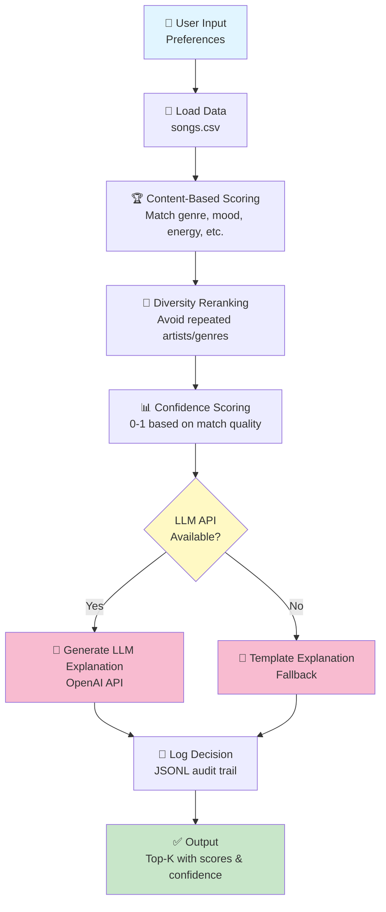

# VibeFinder System Architecture

This directory contains assets for the VibeFinder Applied AI System project.

## Contents

- **architecture-diagram.png** - System architecture flowchart (to be created: use Mermaid Live Editor or draw tool)
- **sample-output.png** - Example CLI output showing recommendations (to be captured: run `python main.py` and screenshot)

## Architecture Overview

The system follows a modular pipeline:

1. **Input** → User preferences (genre, mood, energy, etc.)
2. **Loading** → Read songs.csv and validate inputs
3. **Scoring** → Content-based matching with multiple modes
4. **Reranking** → Apply diversity penalty + compute confidence
5. **Generation** → LLM explains recommendations (with fallback)
6. **Logging** → Audit trail to JSONL
7. **Output** → Top-k recommendations with scores, confidence, and explanations

## How to Create the Architecture Diagram

### Option 1: Mermaid Live Editor (Recommended)
1. Go to https://mermaid.live
2. Paste the diagram code (see below)
3. Export as PNG
4. Save to this directory as `architecture-diagram.png`

### Option 2: Draw Tool
Use any drawing tool (Figma, OmniGraffle, etc.) to create a flowchart matching the description in README.md

### Mermaid Code Template

## How to Create Sample Output Screenshot

1. Configure environment (see README setup steps)
2. Run: `cd src && python main.py`
3. Screenshot the formatted table output
4. Save to `sample-output.png`

---

Generated for VibeFinder Applied AI System  
April 2026
